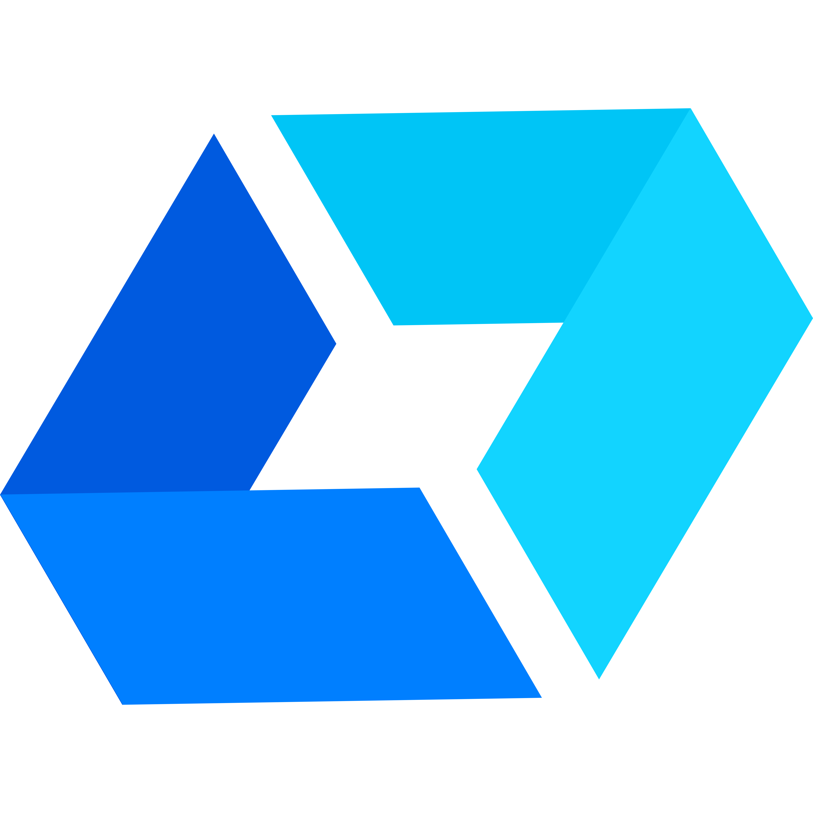

\<div align="center"\>
  \
  
  \# Workshop: Agentes de IA com Python
  
  \#\#\# 🎓 [Jornada de Dados](https://suajornadadedados.com.br/)
  
  **Workshop prático e abrangente sobre desenvolvimento de agentes de IA**  
  *Cobrindo desde frameworks básicos até técnicas avançadas de comunicação entre agentes*
  
  [](https://suajornadadedados.com.br/workshop-agentes-ia-python/)
  [](https://python.org)
  [](https://www.google.com/search?q=./LICENSE)
  
\</div\>

-----

## 🎯 Sobre o Workshop

Este repositório contém o material prático do **Workshop Agentes de IA com Python** da [**Jornada de Dados**](https://suajornadadedados.com.br/). 

**O que você vai aprender:**

  - Construir agentes de IA inteligentes e autônomos
  - Implementar sistemas multi-agente colaborativos  
  - Dominar técnicas avançadas de prompt engineering
  - Criar sistemas RAG (Retrieval-Augmented Generation)
  - Desenvolver memória persistente para agentes
  - Estabelecer comunicação entre agentes via MCP

**🔗 [Inscreva-se no Workshop](https://suajornadadedados.com.br/workshop-agentes-ia-python/)**

## 📚 Módulos do Workshop

### 🤖 [02-frameworks](https://www.google.com/search?q=./02-frameworks/)

**Frameworks de Agentes Multi-Agent**

Explore diferentes frameworks para construção de sistemas multi-agente:

  - **Agno**: Análise inteligente de HackerNews com agentes especializados
  - **AutoGen**: Colaboração entre agentes (Pesquisador + Escritor + Crítico)  
  - **CrewAI**: Geração de conteúdo profissional para LinkedIn
  - **LangChain/LangGraph**: Pipeline visual de análise de texto com grafo de estados

*Conceitos: Multi-agent systems, especialização de papéis, workflows colaborativos*

### 🎯 [03-prompt-engineering](https://www.google.com/search?q=./03-prompt-engineering/)

**Técnicas de Prompt Engineering**

Domine a arte de otimizar prompts para máxima eficácia:

**Técnicas Básicas:**

  - Zero-Shot, Few-Shot, Chain of Thought, Role Prompting

**Técnicas Avançadas:**  

  - Self-Consistency, Tree of Thoughts, Prompt Chaining, Structured Output, Negative Prompting

**Aplicação Prática:**

  - Sistema completo de análise de currículos vs vagas
  - Interface Streamlit para recrutadores e candidatos
  - Geração automática de melhorias e reescrita de CV

*Conceitos: Otimização de prompts, aplicações práticas, análise comparativa*

### 🔍 [04-RAG](https://www.google.com/search?q=./04-RAG/)

**Retrieval-Augmented Generation**

Construa sistemas RAG completos do zero:

**Pipeline Step-by-Step:**

1.  **Document Processing**: Carregamento e extração de PDF
2.  **Text Chunking**: Divisão inteligente com overlap
3.  **Embeddings**: Conversão para vetores com Ollama
4.  **Semantic Search**: Busca por similaridade vetorial
5.  **Context Enrichment**: Combinação e análise de contexto
6.  **Answer Generation**: Geração de respostas contextuais

**Recursos Avançados:**

  - Sistema de avaliação com deepeval (Correctness, Faithfulness, Relevancy)
  - Comparação de técnicas de chunking e retrieval
  - Otimização de parâmetros e debugging

*Conceitos: Vector databases, semantic search, context optimization, RAG evaluation*

### 🧠 [05-memory](https://www.google.com/search?q=./05-memory/)

**Sistemas de Memória para Agentes**

Implemente memória persistente e inteligente:

**CrewAI Memory System:**

  - **Short-term Memory**: ChromaDB para contexto imediato
  - **Long-term Memory**: SQLite para histórico persistente  
  - **Entity Memory**: Reconhecimento de pessoas, lugares e conceitos
  - Agente companion que constrói relacionamentos

**LangChain Memory System:**

  - Interface web Gradio multi-usuário
  - Persistência automática de conversas
  - Isolamento entre usuários diferentes
  - Visualização de dados armazenados

*Conceitos: Persistent memory, entity recognition, multi-user systems, relationship building*

### 🔗 [06-MCP-A2A](https://www.google.com/search?q=./06-MCP-A2A/)

**Model Context Protocol Agent-to-Agent**

Comunicação padronizada entre agentes:

**CrewAI MCP Agent:**

  - Integração com Context7 para análise de documentação
  - Servidor FastMCP para exposição de serviços
  - Interface Streamlit para interação

**LangChain MCP Agent:**

  - LangGraph workflow com visualização avançada
  - Monitoramento step-by-step de execução
  - Comandos de debug interativos
  - Múltiplos servidores MCP

*Conceitos: Protocol standardization, agent orchestration, tool integration, workflow visualization*

## 🏆 [Projeto Final: Sistema Multi-Agente de Suporte](https://www.google.com/search?q=./src/)

Como culminação do aprendizado, o workshop inclui um projeto final prático: a construção de um **Sistema de Suporte ao Cliente Multi-Agente** utilizando **LangGraph**.

**O que o projeto final aborda:**

  - **Arquitetura Multi-Agente**: Implementação de agentes especializados (Técnico, Financeiro, Geral) coordenados por um agente central.
  - **Roteamento Inteligente**: O sistema categoriza a consulta do usuário e a direciona para o agente mais adequado.
  - **Estado Compartilhado**: Demonstra como a informação flui de maneira consistente através do workflow.
  - **Observabilidade**: Integração com LangSmith para rastrear e visualizar a execução completa do fluxo, facilitando o debug e a análise de performance.

Este projeto consolida os conceitos de especialização, colaboração e orquestração de agentes em uma aplicação do mundo real.

**🔗 [Acesse o Projeto Final](https://www.google.com/search?q=./src/)**

## 🚀 Quick Start

### 1\. Configuração Inicial

```bash
# Clonar repositório
git clone <repo-url>
cd workshop-ai-agent

# Instalar dependências globais
pip install -r requirements.txt

# Configurar Ollama (local, gratuito)
ollama serve
ollama pull mistral:latest
ollama pull mxbai-embed-large:latest
```

### 2\. Configurar APIs (Opcional)

```bash
# Para módulos que usam OpenAI
export OPENAI_API_KEY="sua-chave-aqui"

# Para Context7 MCP (Node.js necessário)
npm install -g @upstash/context7-mcp
```

### 3\. Executar Exemplos

```bash
# Frameworks - Agente LangGraph visual
cd 02-frameworks
python langchain_langgraph_starter.py

# Prompt Engineering - Aplicação de análise de CV
cd 03-prompt-engineering  
streamlit run app.py

# RAG - Sistema completo
cd 04-RAG
python RAG_simples.py

# Memory - Interface web multi-usuário
cd 05-memory
python langchain_memory_example.py

# MCP - Comunicação entre agentes
cd 06-MCP-A2A
python crewai_mcp_agent.py  # Terminal 1
streamlit run app.py        # Terminal 2

# Projeto Final - Sistema de Suporte
cd src
python main.py
```

## 🛠️ Tecnologias Utilizadas

### AI Frameworks

  - **LangChain/LangGraph**: Orquestração e workflows visuais
  - **CrewAI**: Sistemas multi-agente estruturados  
  - **AutoGen**: Colaboração conversacional entre agentes
  - **Agno**: Especialização em análise de dados

### LLMs e Embeddings

  - **Ollama**: Modelos locais (Mistral, mxbai-embed-large)
  - **OpenAI**: GPT-4 para casos específicos
  - **Local-first**: Prioridade para soluções offline

### Storage e Memória

  - **ChromaDB**: Vector database para embeddings
  - **FAISS**: Vector search eficiente
  - **SQLite**: Persistência relacional
  - **File System**: Documentos e configurações

### Interfaces

  - **Streamlit**: Aplicações web rápidas
  - **Gradio**: Interfaces ML intuitivas
  - **CLI**: Linha de comando interativa

## 📊 Progressão de Aprendizado

```
Básico          Intermediário        Avançado           Expert
│               │                    │                  │
├─ Frameworks   ├─ Prompt Eng.      ├─ RAG             ├─ MCP A2A
│  Single Agent │  Optimization      │  Vector Search   │  Protocol
│  Collaboration│  Techniques        │  Context Mgmt    │  Communication
│               │                    │                  │
└─ Foundation   └─ Enhancement       └─ Knowledge       └─ Integration & Projeto Final
```

## 🎯 Casos de Uso Práticos

### Empresarial

  - **Customer Support**: Agentes com memória de histórico
  - **HR/Recrutamento**: Análise automatizada de currículos
  - **Knowledge Management**: RAG para base de conhecimento
  - **Process Automation**: Workflows com múltiplos agentes

### Desenvolvimento

  - **Code Assistant**: Análise de documentação técnica
  - **Testing**: Agentes para QA automatizado
  - **DevOps**: Automação de deployment com contexto
  - **Monitoring**: Agentes de observabilidade

### Pesquisa e Educação

  - **Research Assistant**: RAG para papers científicos
  - **Content Creation**: Geração com múltiplas perspectivas
  - **Language Learning**: Tutores adaptativos com memória
  - **Data Analysis**: Insights automatizados

## 🔄 Integrações entre Módulos

Os módulos são projetados para trabalhar em conjunto:

  - **Frameworks** como base para **Memory** e **MCP**
  - **Prompt Engineering** otimiza todos os outros módulos
  - **RAG** serve como knowledge base para **Memory**
  - **MCP** permite comunicação entre agentes de diferentes **Frameworks**
  - O **Projeto Final** integra todos os conceitos em uma aplicação prática.

## 🤝 Contribuição

Contribuições são bem-vindas\! Áreas de interesse:

  - Novos frameworks de agentes
  - Técnicas avançadas de prompt engineering  
  - Otimizações de RAG e retrieval
  - Sistemas de memória mais sofisticados
  - Protocolos de comunicação entre agentes
  - Exemplos de casos de uso reais

## 📞 Suporte e Comunidade

  - **🎓 [Workshop Oficial](https://suajornadadedados.com.br/workshop-agentes-ia-python/)**: Acesso completo com mentoria
  - **🌐 [Jornada de Dados](https://suajornadadedados.com.br/)**: Plataforma completa de aprendizado
  - **📧 Issues**: Para bugs e dúvidas técnicas neste repositório
  - **💬 Discussions**: Para ideias e casos de uso
  - **📚 Wiki**: Documentação adicional e tutoriais

## 📄 Licença

MIT License - veja [LICENSE](https://www.google.com/search?q=./LICENSE) para detalhes.

-----

\<div align="center"\>
  
**🚀 [Comece sua jornada no desenvolvimento de agentes de IA inteligentes\!](https://suajornadadedados.com.br/workshop-agentes-ia-python/)**

\</div\>