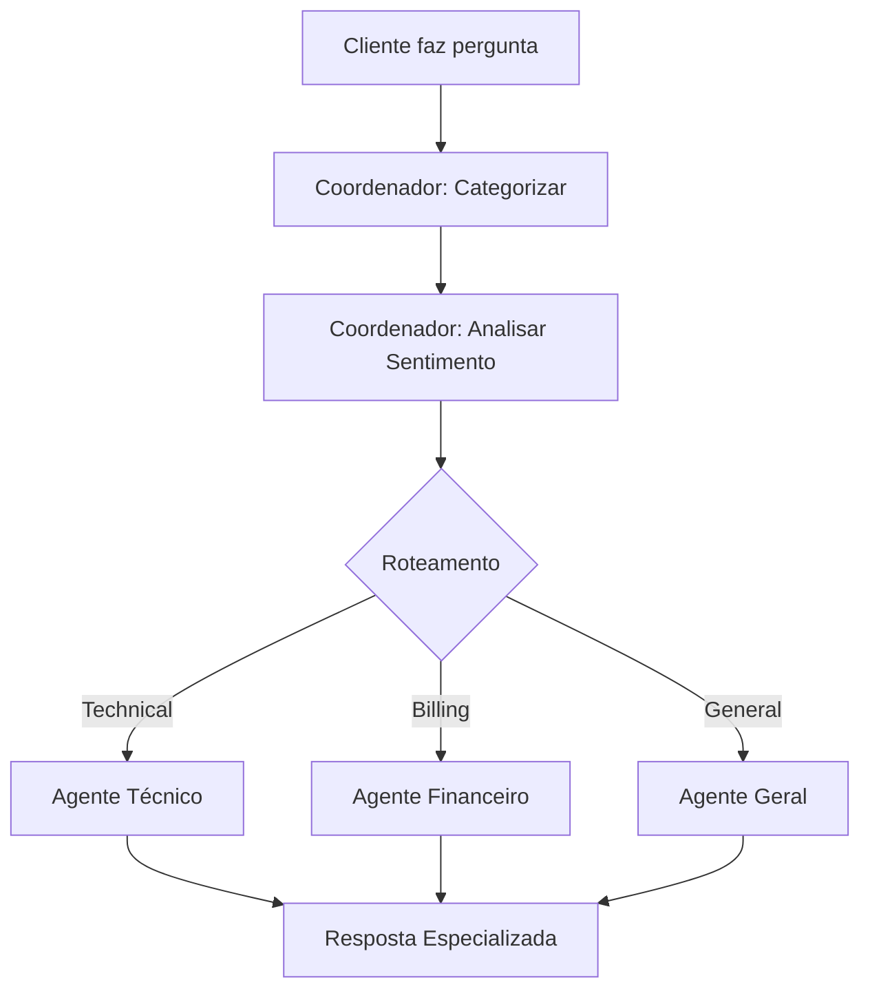

# 🤖 Sistema Multi-Agente de Suporte

Um projeto educacional demonstrando como múltiplos agentes especializados trabalham em conjunto usando **LangGraph** para criar um sistema inteligente de atendimento ao cliente.

[](https://www.langchain.com/)
[](https://langchain-ai.github.io/langgraph/)
[](https://www.langchain.com/langsmith)
[](https://openai.com/)
[](https://www.sqlite.org/index.html)

## 🎯 Objetivo

Este projeto demonstra conceitos fundamentais de sistemas multi-agente:
- **Especialização de Agentes** - Cada agente tem uma função específica
- **Coordenação Inteligente** - Workflow automatizado decide qual agente usar
- **Estado Compartilhado** - Informações fluem entre agentes
- **Observabilidade** - Rastreamento completo via LangSmith

## 🏗️ Arquitetura

### Agentes Especializados

| Agente | Função | Especialidade |
|--------|--------|---------------|
| **Coordenador** | Análise inicial | Categorização + Sentimento |
| **Técnico** | Suporte técnico | Problemas de sistema, login, bugs |
| **Financeiro** | Questões financeiras | Cobrança, pagamentos, reembolsos |
| **Geral** | Informações gerais | Horários, contato, políticas |

### Fluxo de Processamento

O diagrama abaixo mostra o fluxo real gerado pelo LangGraph, demonstrando como as consultas fluem entre os agentes especializados.



## 🚀 Como Usar

### 1. Configuração do Ambiente

```bash
# Clonar/baixar o projeto
cd src

# Criar ambiente virtual (recomendado)
python -m venv .venv
source .venv/bin/activate  # Linux/Mac
# ou
.venv\Scripts\activate     # Windows

# Instalar dependências
pip install -r requirements.txt
```

### 2. Configurar Variáveis de Ambiente

Crie um arquivo `.env` na pasta raiz (mesmo nível da pasta `src`):

```env
# OpenAI (obrigatório)
OPENAI_API_KEY=sua-chave-openai-aqui

# LangSmith (opcional - para observabilidade)
LANGSMITH_TRACING=true
LANGSMITH_ENDPOINT="https://api.smith.langchain.com"
LANGSMITH_API_KEY="sua-chave-langsmith-aqui"
LANGSMITH_PROJECT="nome-do-seu-projeto"
```

### 3. Executar o Sistema

```bash
# A partir da pasta src
python main.py
```

### 4. Ver Resultados

**No Terminal:**
```
🎓 DEMO SISTEMA MULTI-AGENTE
📝 CASO 1: Não consigo fazer login no sistema
🎯 Categorizando consulta...
📂 Categoria identificada: Technical
🔧 Processando com Agente Técnico...
✅ Solução técnica gerada
```

**Visualização do Workflow:**
- O arquivo `graph/workflow_diagram.png` é gerado automaticamente
- Mostra o fluxo visual do sistema

**LangSmith (se configurado):**
- Acesse https://smith.langchain.com
- Veja traces detalhados de cada agente
- Analise performance e fluxos


*Exemplo de visualização no LangSmith mostrando o trace completo do sistema multi-agente em execução.*

## 📁 Estrutura do Projeto

```
projeto-raiz/
├── .env                           # Variáveis de ambiente
├── assets/                        # Recursos do projeto
│   └── langsmith.png             # Screenshot do LangSmith
│
└── src/                          # Pasta principal do projeto
    ├── __init__.py               # Módulo Python
    ├── main.py                   # Ponto de entrada principal
    ├── requirements.txt          # Dependências Python
    │
    ├── agents/                   # Agentes especializados
    │   ├── __init__.py          # Módulo Python
    │   ├── agente_coordenador.py # Coordenador (categoriza/analisa)
    │   ├── agente_tecnico.py    # Especialista técnico
    │   ├── agente_financeiro.py # Especialista financeiro
    │   └── agente_geral.py      # Atendimento geral
    │
    ├── graph/                    # Workflow LangGraph
    │   ├── __init__.py          # Módulo Python
    │   ├── workflow_suporte.py  # Definição do workflow
    │   └── workflow_diagram.png # Diagrama gerado automaticamente
    │
    ├── orchestration/            # Coordenação e orquestração
    │   └── __init__.py          # Módulo Python
    │
    └── utils/                    # Utilitários
        ├── __init__.py          # Módulo Python
        └── state.py             # Estado compartilhado entre agentes
```

## 🧪 Casos de Teste

O sistema processa automaticamente estes cenários:

### Caso 1: Problema Técnico
```
Entrada: "Não consigo fazer login no sistema"
Fluxo: Coordenador → Técnico
Resultado: Instruções passo-a-passo para resolver login
```

### Caso 2: Questão Financeira
```
Entrada: "Fui cobrado em duplicata no meu cartão"
Fluxo: Coordenador → Financeiro
Resultado: Orientações sobre reembolso e verificação de cobrança
```

### Caso 3: Informação Geral
```
Entrada: "Qual o horário de funcionamento da empresa?"
Fluxo: Coordenador → Geral
Resultado: Informações sobre horários e contato
```

## 🎓 Conceitos Demonstrados

### 1. **Multi-Agente**
- Especialização vs generalização
- Coordenação entre agentes
- Estado compartilhado

### 2. **LangGraph**
- Workflows como grafos
- Roteamento condicional
- Nós e edges (arestas)

### 3. **LangChain**
- Prompts estruturados
- Integração com LLMs
- Chains de processamento

### 4. **Observabilidade**
- Tracing de execução
- Debugging de fluxos
- Métricas de performance

## 🔧 Personalização

### Adicionar Novo Agente

1. **Criar arquivo** em `src/agents/agente_novo.py`:
```python
class AgenteNovo:
    def processar_consulta(self, state):
        # Sua lógica aqui
        return {"response": "resposta", "agent_used": "Novo"}
```

2. **Modificar workflow** em `src/graph/workflow_suporte.py`:
```python
# Adicionar nó
workflow.add_node("agent_novo", self._processar_novo)

# Adicionar roteamento
if category == CategoryType.NOVA_CATEGORIA:
    return "agent_novo"
```

### Modificar Categorias

Edite `src/utils/state.py`:
```python
class CategoryType(str, Enum):
    TECHNICAL = "Technical"
    BILLING = "Billing"
    GENERAL = "General"
    NOVA_CATEGORIA = "NovaCategoria"  # Adicionar aqui
```

## 🐛 Troubleshooting

### Problema: ModuleNotFoundError
**Solução:** Verificar se todas as dependências estão instaladas:
```bash
pip install -r requirements.txt
```

### Problema: OpenAI API Error
**Solução:** Verificar se `OPENAI_API_KEY` está configurada corretamente no `.env`

### Problema: LangSmith não aparece
**Solução:** 
- Verificar `LANGSMITH_API_KEY` no `.env`
- LangSmith é opcional - sistema funciona sem ele

### Problema: Arquivo de agente não encontrado
**Solução:** Verificar se todos os arquivos em `src/agents/` foram criados e se os `__init__.py` estão presentes

## 📚 Recursos Adicionais

- **LangGraph Docs:** https://langchain-ai.github.io/langgraph/
- **LangChain Docs:** https://python.langchain.com/
- **LangSmith:** https://smith.langchain.com/
- **OpenAI API:** https://platform.openai.com/docs

## 🤝 Contribuindo

Este é um projeto educacional. Sugestões de melhoria:

1. **Fork** o projeto
2. **Crie** uma branch para sua feature
3. **Implemente** melhorias
4. **Teste** o sistema
5. **Envie** pull request

## 📄 Licença

Projeto educacional - use livremente para aprendizado e demonstrações.

---

**Desenvolvido para demonstrar conceitos de sistemas multi-agente com LangGraph** 🤖✨
